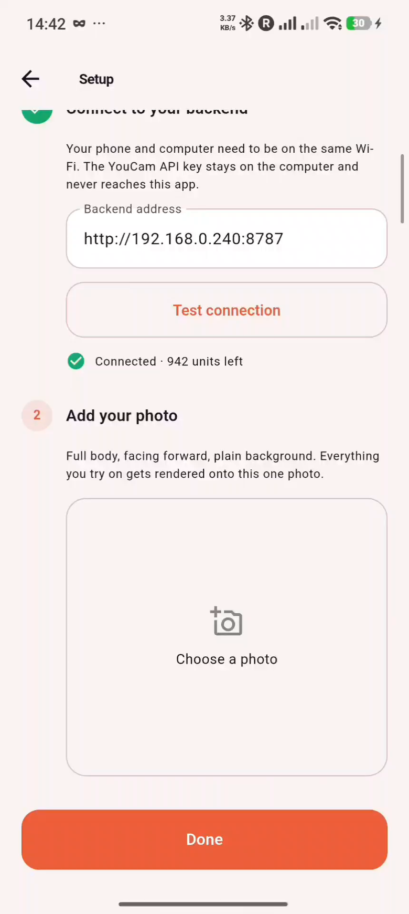
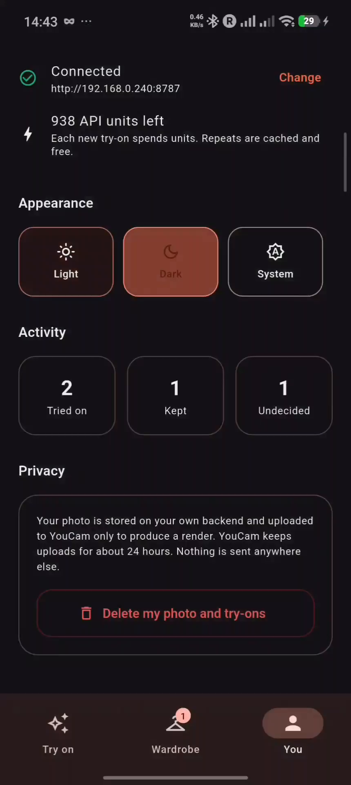

# EasyBuy — try it on before you buy

An Android app that lives in the **share sheet**. In any shopping app or browser, tap Share →
EasyBuy, and see yourself wearing the item. No account, no upload flow, no separate try-on site.

Built on the **YouCam Apparel VTO API** (Perfect Corp).

> Hackathon submission write-up: **[SUBMISSION.md](SUBMISSION.md)**

<p align="center">
  
  
  
  
</p>

<p align="center">
  <em>Share a product link or a screenshot · drag to compare · keep or pass · the shortlist builds itself</em>
</p>

---

## Why the share sheet

Try-on already exists as a destination — a site you visit, upload a photo, upload a garment,
wait. Almost nobody does that mid-purchase, because the decision happens on the product page and
lasts a few seconds.

Shopping also happens in **apps**, not browsers, and Chrome on Android has no extensions at all.
The share sheet is the one entry point that reaches everywhere: the Zara app, the Vinted app,
Amazon, Chrome, Instagram, TikTok.

Two kinds of share are handled, and the second is the one nobody covers:

- **A product link.** The app resolves it to the garment image and renders it.
- **A screenshot.** Instagram and TikTok outfits have no product page and no image URL. A
  screenshot is all a user has, and it is enough.

---

## Architecture

```
Android app (Flutter)                      Local proxy (Node)            YouCam API
─────────────────────                      ──────────────────            ──────────
share sheet intake  ─ link or image ─┐
hidden WebView      ─ runs the       │
                      extractor JS   ├──▶ POST /api/extract  (server-side, fast path)
image fetch on-device                │
                                     ├──▶ POST /api/tryon ───┬─▶ POST /s2s/v2.0/file/cloth
render history, before/after         │                       ├─▶ POST /s2s/v2.0/task/cloth
                                     │                       └─▶ GET  /s2s/v2.0/task/cloth/:id
                                     ▼
                          holds YOUCAM_API_KEY
```

**The API key never enters the app.** It lives in `backend/.env` and every call is proxied.

### The problem that shaped the design

The obvious way to resolve a shared link is to fetch the page server-side and read `og:image`.
That fails on exactly the stores that matter:

```
403  zara.com          403  hm.com          000  asos.com
```

…and it still fails with a `facebookexternalhit` user agent, because these sites fingerprint the
TLS handshake, not just the headers.

A phone does not have this problem. It *is* a browser. So the app loads the shared URL in a
one-pixel offscreen WebView and runs **the same extractor script the Chrome extension injects**
— one extractor, two hosts. The page's own JavaScript has finished by then, so single-page
stores work too.

The same logic applies to the garment image itself: the app fetches the bytes on-device and
sends them along with the URL. The server tries the free URL path first (`ref_file_url`, which
YouCam fetches itself) and falls back to the app-supplied bytes when the CDN refuses — no failed
round trip.

`POST /api/extract` is still the first thing tried, because it is instant for smaller shops,
Shopify stores and direct image links. The WebView is the fallback, not the default.

### Other details worth pointing at

**Renders are cached on the garment URL, not the task id.** Re-sharing something you already
tried is instant and spends zero units. Results are copied to disk because YouCam download links
expire in about two hours and uploaded files in 24 — a render that exists only as a remote URL is
gone by the time you want to show someone.

**Extraction returns ranked candidates, not one guess.** A product page has the garment on a
model, flat, and in detail crops, and try-on quality depends heavily on which goes in. Per-store
adapters run first, then JSON-LD `Product.image`, then a generic scorer that ranks every rendered
image by area and position and penalises headers, footers and "related items" rails. The result
screen shows the strip so you can switch. An adapter going stale degrades to the generic path
instead of breaking.

---

## Setup

### 1. Backend (on your computer)

```bash
cd backend
npm install
cp ../.env.example .env      # paste your key into it
npm run verify               # confirms auth, prints your unit balance
npm start
```

Get a key at <https://yce.makeupar.com/api-console/en/api-keys/>.

Note the machine's LAN address — `hostname -I` — the phone needs it.

### 2. App

```bash
cd mobile
flutter build apk --release
```

Output: `mobile/build/app/outputs/flutter-apk/app-release.apk`.

Install it with `adb install -r <path>`, or copy the APK to the phone and open it (allow
"install unknown apps" when prompted).

### 3. First run

1. Open EasyBuy → **Setup**
2. Set the proxy address to `http://<your-lan-ip>:8787` and tap **Test connection**
3. Pick a full-body photo, facing forward, plain background — everything renders onto it

Phone and computer must be on the same Wi-Fi.

### 4. Use it

Open any product page or shopping app → **Share** → **EasyBuy**. Or share a screenshot of an
outfit from Instagram or TikTok. The Home screen also has **Photo** and **Link** buttons for
trying it without the share sheet.

---

## `npm run verify`

The public YouCam docs publish the endpoints but not the exact request body for the clothes task,
so the client ships with candidate shapes and negotiates on first use.

```bash
npm run verify                                        # auth + balance, spends nothing
npm run verify -- --live <person-url> <garment-url>   # one real render, spends units
```

The `--live` run prints which body shape the server accepted and the full finished-task response.
After that, `buildBodies()` in `backend/src/youcam.js` can be collapsed to the single winning
variant and `pickRenderUrl()` in `backend/src/index.js` tightened to the exact result field.

---

## Store coverage

| Store | Extraction |
| --- | --- |
| Zara | picture/source elements, width param bumped to 1500 |
| H&M | product detail gallery |
| Amazon | `data-a-dynamic-image` resolution map, size suffix stripped for full res |
| Vinted | listing photos + description (size and condition shown with the render) |
| Depop | product gallery |
| Anything else | JSON-LD `Product.image`, then the generic image scorer |
| No page at all | shared screenshot |

Vinted and Depop are the case that matters most: resale has no returns, so the buy is pure
guesswork today, and the listing photo is already the flat garment shot the API wants.

---

## Repository layout

```
backend/     Node proxy. Holds the API key, drives the YouCam task lifecycle.
mobile/      Flutter Android app. The primary client.
extension/   Chrome MV3 extension. Desktop companion, same backend, same extractor.
```

The extension came first and still works — load `extension/` unpacked at `chrome://extensions`.
It shares `content/adapters.js` with the app, which is copied to `mobile/assets/extractor.js`.

## Proxy endpoints

| Method | Path | Purpose |
| --- | --- | --- |
| `GET` | `/api/health` | proxy status, key presence, unit balance |
| `POST` | `/api/model` | store a person photo |
| `GET` | `/api/models` | saved photos and which is active |
| `POST` | `/api/extract` | resolve a shared link to garment candidates |
| `POST` | `/api/tryon` | start a render, returns `jobId` (or a cached result) |
| `GET` | `/api/tryon/:jobId` | job state and stage |
| `GET` | `/api/renders` | every render, newest first |

---

## Known limits

- Full-body, front-facing photos render best; heavy occlusion or a busy background degrades output.
- The proxy is single-user and holds jobs in memory — right for a local tool, wrong for a deployment.
- Store adapters are DOM selectors and will drift as sites redeploy; the generic scorer is the safety net.
- Calls are spaced 220ms apart to stay under the API's 5 QPS ceiling.
- The app talks to the proxy over plain HTTP on the LAN, which is why `usesCleartextTraffic` is set.
  A deployed build would use HTTPS and drop that flag.

## Screenshots

| Setup | Rendering a Zara link | Verdict on a try-on | Dark theme |
| --- | --- | --- | --- |
|  |  |  |  |

Every screenshot is a frame from the demo recording on a real phone. The progress shot is a real
Zara link resolved through the on-device WebView — the same store that returns 403 to any
server-side fetch.

## Demo video

A 1 minute 18 second walkthrough, recorded on a real phone:

**▶ https://youtu.be/YOUR_VIDEO_ID**

It covers setup, sharing a live Zara link, the render, drag-to-compare, the zoom views, keep/pass,
the Wardrobe, and the privacy controls.

## Credits

The person photo used in the screenshots and the demo video is a stock image from
[Pixabay](https://pixabay.com), used under the Pixabay Content License — free to use, including
commercially, with no attribution required. It is not a photo of a real user of the app.

Garment imagery in the demo comes from live retailer product pages, shown as ordinary browsing
footage; no store assets are redistributed in this repository.

## Licence

MIT — see [LICENSE](LICENSE).
