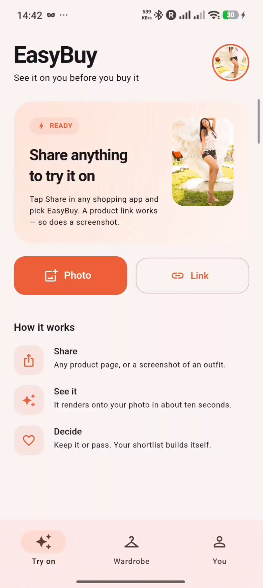
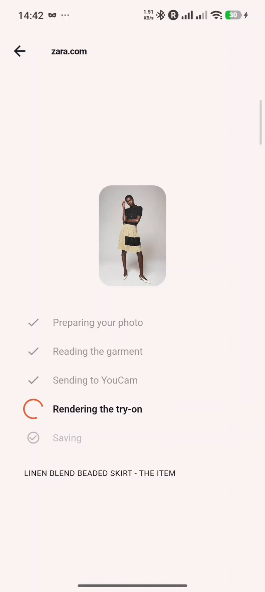
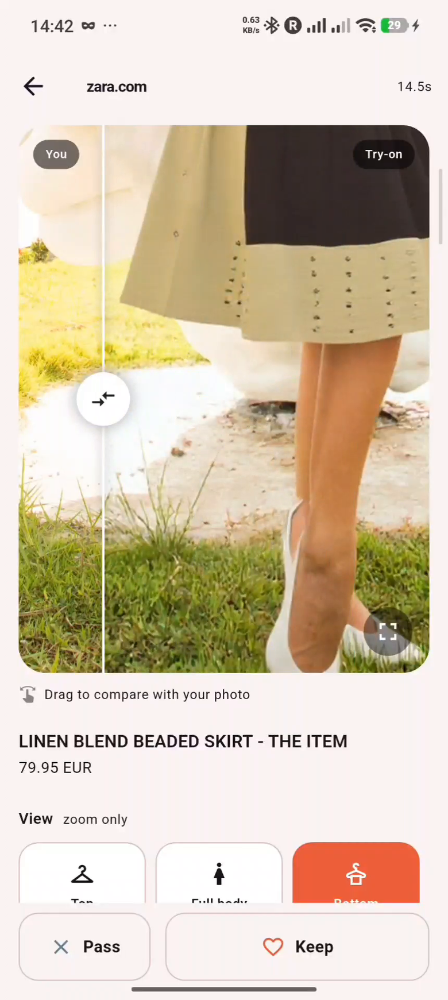
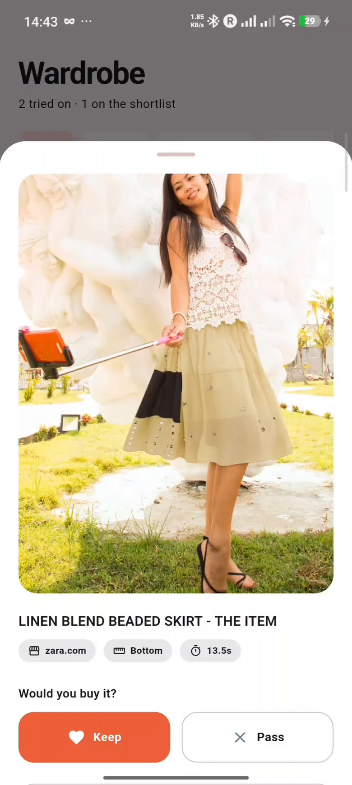
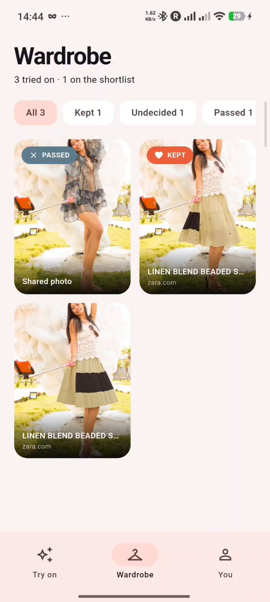
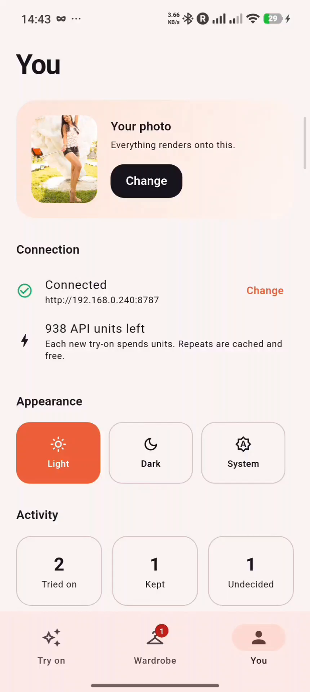

# EasyBuy — submission

**Demo video:** https://youtu.be/dt06IemjrnI
**Repository:** https://github.com/Ishivijay/EasyBuy
**Track:** Apparel Virtual Try-On
**YouCam API used:** Apparel VTO (AI Clothes) — `POST /s2s/v2.0/file/cloth`, `POST /s2s/v2.0/task/cloth`, `GET /s2s/v2.0/task/cloth/{task_id}`, plus `GET /s2s/v1.0/client/credit` for the unit balance shown in-app.

---

## What it is

EasyBuy is an Android app that lives in the **share sheet**. In any shopping app or browser —
Zara, Vinted, Amazon, Chrome, Instagram — you tap Share, pick EasyBuy, and see yourself wearing
the item about ten seconds later. Then you keep it or pass on it, and your shortlist builds itself.

There is no upload flow, no account, and no separate try-on website to visit.

## The problem

Virtual try-on already exists as a *destination*: a site you navigate to, upload a photo, upload a
garment, and wait. Almost nobody does that mid-purchase, because the decision happens on the
product page and lasts a few seconds.

Two things follow from that, and they shaped the whole product:

1. **Shopping happens in apps, not browsers.** Chrome on Android has no extensions at all, so a
   browser extension cannot reach the Zara app or the Vinted app. The share sheet is the one entry
   point that reaches everywhere.
2. **A lot of what people want to try on has no product page.** An outfit on Instagram or TikTok
   has no URL and no product image — a screenshot is all the user has. EasyBuy accepts that as a
   first-class input, not a fallback.

## Consumer and retail value

- **Fewer returns, more confidence.** Apparel return rates run high precisely because fit and look
  are guesses. Seeing the garment on your own photo before checkout turns the guess into a decision.
- **Resale is the sharpest case.** Vinted, Depop and eBay have no returns at all — buy it and you
  own it. It is the highest-risk apparel purchase there is and has no try-on tooling. The listing
  photo is already the flat garment shot the API wants.
- **A shortlist that reflects reality.** Every try-on carries a verdict (keep / pass). The Wardrobe
  tab becomes a list of things the shopper has actually seen on themselves and would buy — far
  stronger purchase intent than a conventional wishlist.
- **Zero merchant integration.** EasyBuy works on any store without that store adopting anything.

---

## Features

| Feature | What it does |
| --- | --- |
| **Share-sheet try-on** | Any product link or screenshot, from any app, becomes a try-on |
| **Screenshot input** | Handles Instagram/TikTok outfits that have no product page at all |
| **On-device page extraction** | An offscreen WebView finds the product photo on stores that block servers |
| **Ranked image candidates** | Product pages have several photos; the user can switch which one is used |
| **Fit selector** | Top / Bottom / Full body, re-rendering on tap |
| **Drag-to-compare** | A slider between the original photo and the render |
| **Keep / pass verdicts** | Turns a render into a buying decision; builds the shortlist |
| **Wardrobe** | Every try-on across every store, filterable by verdict |
| **Render cache** | Re-trying something already rendered is instant and spends zero API units |
| **Privacy controls** | One button deletes the photo and every render made from it |

---

## How the YouCam API is used

The app never holds the API key. A local Node proxy holds it and drives the task lifecycle:

```
POST /s2s/v2.0/file/cloth        upload the person photo, get a file_id
POST /s2s/v2.0/task/cloth        src_file_id + ref_file_url|ref_file_id + garment_category
GET  /s2s/v2.0/task/cloth/{id}   poll until success
GET  /s2s/v1.0/client/credit     unit balance, surfaced in the You tab
```

Three things go beyond a plain wrapper:

**Garment images are passed as URLs when possible.** `ref_file_url` lets YouCam fetch the store's
image itself — no download, no re-upload, no round trip. The app also sends the bytes it fetched,
so when a CDN refuses YouCam's fetch, the server falls back to those bytes instead of failing.

**The person photo's `file_id` is cached for 20 hours** and re-uploaded transparently when it ages
out, so repeat try-ons skip the upload entirely.

**Renders are cached on the garment URL, not the task id**, and copied to disk — YouCam download
links expire in about two hours and uploads in 24, so a render that exists only as a remote URL is
gone by the time the user wants to look at it again.

---

## Engineering notes

**Large retailers block server-side fetching.** Resolving a shared link server-side and reading
`og:image` fails on exactly the stores that matter — Zara, H&M and ASOS all return 403, and they
still do with a `facebookexternalhit` user agent, because they fingerprint the TLS handshake, not
just the headers. A phone does not have this problem: it *is* a browser. So the app loads the
shared URL in a one-pixel offscreen WebView and runs the same extractor script the companion Chrome
extension injects — one extractor, two hosts. Screenshot 5 shows this working on a Zara link.

**Image format matters more than expected.** Fetching garment images with a browser-style
`Accept: image/avif,image/webp,…` makes content-negotiating CDNs return AVIF or WebP, which the
try-on API cannot read — try-ons failed on some stores and not others. The fetchers now request
JPEG/PNG only, and the server identifies images by magic bytes rather than trusting `Content-Type`.

**Extraction degrades instead of breaking.** Per-store adapters run first, then JSON-LD
`Product.image`, then a generic scorer that ranks every rendered image by area and position and
penalises headers, footers and "related items" rails. A stale adapter falls through to the generic
path rather than taking the feature down.

---

## Screenshots

| | |
| --- | --- |
|  |  |
| **Home** — share anything to try it on | **Rendering** — the real pipeline, on a Zara link |
|  |  |
| **Result** — drag to compare, zoom top or bottom | **Detail** — store, fit, render time, verdict |
|  |  |
| **Wardrobe** — filterable by keep / pass | **You** — photo, units, theme, privacy |

All screenshots are frames from the demo video, captured on a real phone.

The person shown is a stock photo from [Pixabay](https://pixabay.com), used under the Pixabay
Content License (free for commercial use, no attribution required) — not a real user.

---

## Running it

Full instructions are in [README.md](README.md). In short: put a YouCam API key in `backend/.env`,
run `npm start`, build the APK with `flutter build apk --release`, and point the app at the
machine's LAN address.

## Repository

```
backend/     Node proxy. Holds the API key, drives the YouCam task lifecycle.
mobile/      Flutter Android app. The primary client.
extension/   Chrome MV3 extension. Desktop companion, same backend, same extractor.
```

Licensed MIT.
